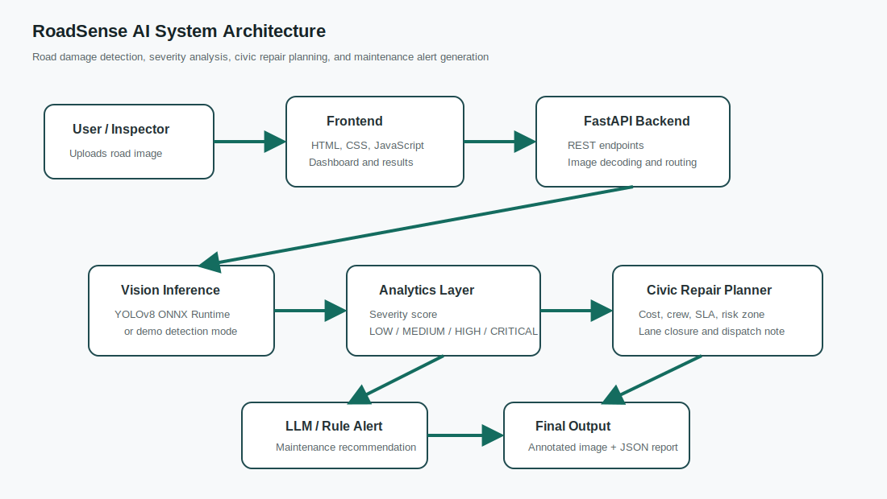
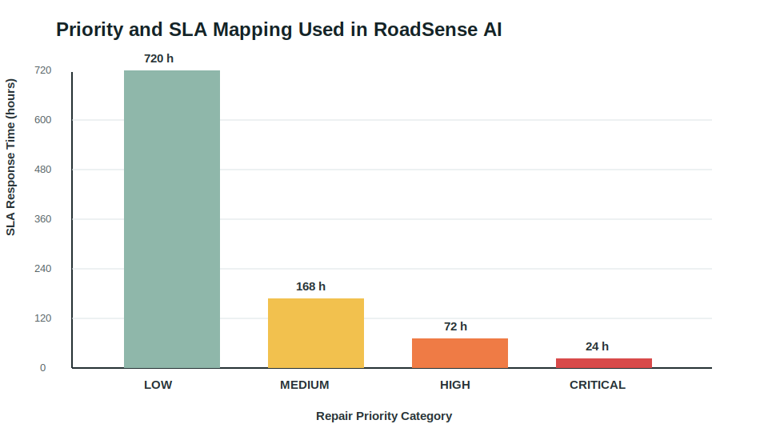
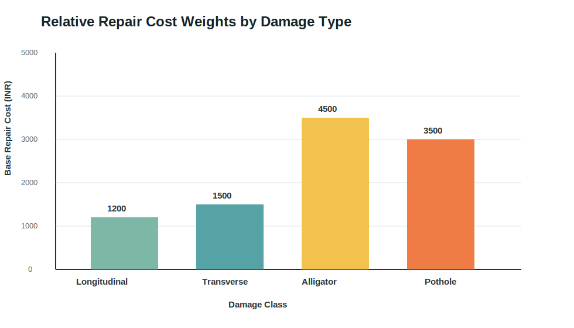

# RoadSense AI: Road Damage Detection and Civic Repair Planning Using Lightweight Computer Vision

**Author:** Ansari  
**Department:** Software Engineering in Artificial Intelligence  
**Repository:** https://github.com/ansari6926/SEAI-ansari-project

## Abstract

Road damage inspection is an important task for safe and sustainable transportation infrastructure. Traditional inspection methods are manual, slow, and difficult to scale. This paper presents RoadSense AI, a lightweight road damage detection and civic repair planning system. The software accepts road images through a browser dashboard or REST API, performs computer vision based damage analysis, calculates severity, assigns repair priority, and generates a civic maintenance plan. The main novelty of the system is the Civic Repair Planner, which converts detections into repair cost, crew size, service-level agreement, lane closure requirement, risk zone, SDG alignment, and dispatch note. The system uses FastAPI, OpenCV, ONNX Runtime, Docker, and a static web dashboard. The project is aligned with SDG 3, SDG 9, and SDG 11 by supporting safer roads, resilient infrastructure, and sustainable cities.

**Keywords:** Road damage detection, smart city, FastAPI, ONNX Runtime, civic repair planning, computer vision, sustainable infrastructure.

## I. Introduction

Road surface defects such as potholes, alligator cracks, longitudinal cracks, and transverse cracks can cause accidents, traffic delays, and vehicle damage. Municipal road maintenance teams must inspect large road networks and prioritize repairs based on severity and public safety. Manual inspection is still widely used, but it is time-consuming and dependent on field staff availability.

Computer vision can improve this process by detecting road damage from images. However, many academic and open-source prototypes stop at visual detection and do not produce maintenance decisions. In real civic workflows, the output must answer practical questions: How urgent is the repair? How many workers are needed? What is the expected response time? Is lane closure required? What is the approximate cost?

RoadSense AI addresses this gap by adding a civic planning layer above road damage detection. The system provides both detection output and decision-support output.

## II. Related Work

Road damage detection has been studied using convolutional neural networks and YOLO-based object detection models. YOLO models are popular because they provide fast object detection and can be exported to formats such as ONNX for CPU-friendly inference. FastAPI is commonly used for lightweight machine learning inference APIs, while Docker is used to package the application for repeatable deployment.

Existing systems generally focus on model accuracy and bounding-box output. RoadSense AI focuses on software impact by connecting detection output with civic maintenance planning.

## III. Proposed System

The proposed system contains a frontend dashboard, FastAPI backend, ONNX-ready inference layer, analytics layer, Civic Repair Planner, and alert generator.



Fig. 1. RoadSense AI system architecture.

The user uploads a road image from the browser. The backend decodes the image using OpenCV. If an ONNX model is available, the backend uses ONNX Runtime for inference. If the model file is unavailable, the system runs deterministic demo detections. The detections are processed by severity, priority, and civic planning modules.

## IV. Methodology

The methodology is divided into five stages.

### A. Image Input and Preprocessing

The image is uploaded through the `/api/v1/detect` endpoint. OpenCV decodes the image and prepares it for inference.

### B. Detection

The detection layer supports YOLOv8 ONNX output. In demo mode, plausible deterministic detections are generated so the software can be evaluated without requiring a large trained model file.

### C. Severity Scoring

Each detected damage class is assigned a severity weight. Potholes and alligator cracks receive higher weights than longitudinal cracks. The final severity score combines class weight, confidence, and bounding-box area ratio.

### D. Repair Priority

The priority service classifies road damage into LOW, MEDIUM, HIGH, or CRITICAL categories.



Fig. 2. Repair priority and SLA mapping.

### E. Civic Repair Planner

The Civic Repair Planner estimates repair cost, crew size, SLA hours, risk zone, lane closure requirement, SDG alignment, and dispatch note.



Fig. 3. Base repair cost weights used by the planner.

## V. Implementation

The backend is implemented in Python using FastAPI. The frontend is implemented using static HTML, CSS, and JavaScript. Dockerfiles are provided for backend and frontend containers. Docker Compose is used to run the full stack. Kubernetes deployment YAML is included for container orchestration practice.

The main API endpoints are:

| Endpoint | Function |
|---|---|
| `/api/v1/health` | Service health check |
| `/api/v1/detect` | Full image detection and annotated output |
| `/api/v1/analyze` | Analytics-only output |
| `/api/v1/plan` | Manual repair plan generation |

## VI. Results and Discussion

RoadSense AI was tested locally in demo mode. The backend health endpoint returned successful status, and the frontend loaded successfully in the browser. A sample image analysis produced detection count, severity score, HIGH repair priority, estimated cost, crew size, SLA hours, and traffic-control recommendation.

Example output:

```json
{
  "num_detections": 4,
  "severity_score": 0.2129,
  "repair_priority": "HIGH",
  "estimated_cost_inr": 12100,
  "crew_size": 2,
  "sla_hours": 72
}
```

The result shows that RoadSense AI is not only a detection system but also a maintenance decision-support system.

## VII. Software Impact

RoadSense AI supports SDG 3 by improving road safety, SDG 9 by supporting resilient infrastructure, and SDG 11 by contributing to sustainable cities. The project is simple, explainable, and easy to run in academic environments. Its demo mode also makes it useful where GPU resources or trained model files are unavailable.

## VIII. Conclusion

This paper presented RoadSense AI, a lightweight road damage detection and civic repair planning system. The novelty of the project is the Civic Repair Planner, which transforms AI detections into practical repair decisions. The project includes inference API, frontend dashboard, Docker configuration, Kubernetes deployment file, GitHub version control, and IEEE-style documentation.

## References

[1] G. Jocher et al., "Ultralytics YOLOv8," Ultralytics documentation.  
[2] Microsoft, "ONNX Runtime Documentation."  
[3] S. Ramírez, "FastAPI Documentation."  
[4] Docker Inc., "Docker Documentation."  
[5] United Nations, "Sustainable Development Goals."  
